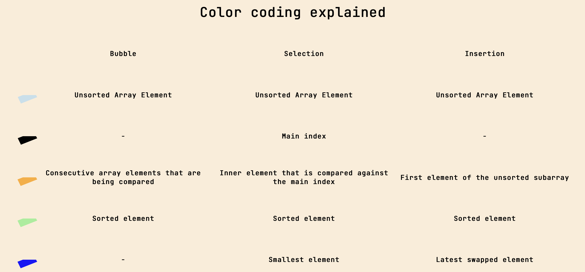

# SortingVisualizer

A react website for visualizing sorting techniques: Avaialable at : https://tratikdixit.github.io/SortingVisualizer/

## Color Codes

Different colors used represent

 

## Different Sorting Techniques Available

### Bubble Sort
 

### Selection Sort
 

### Insertion Sort
 

